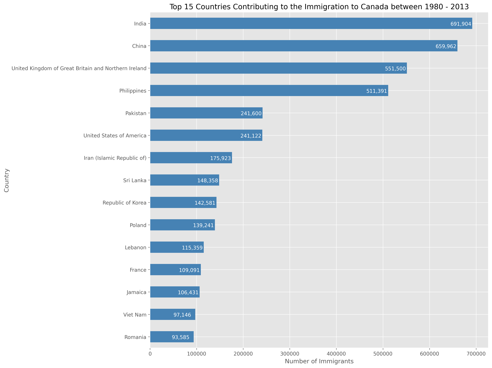
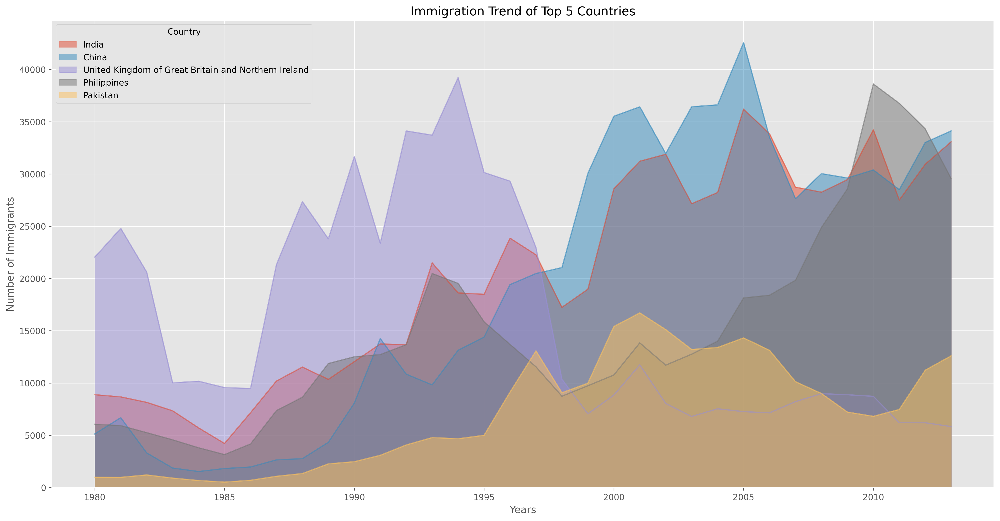
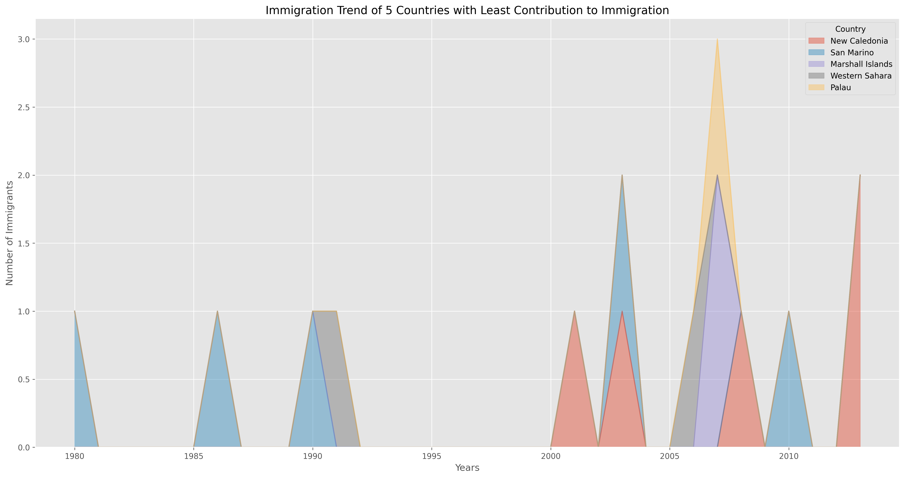
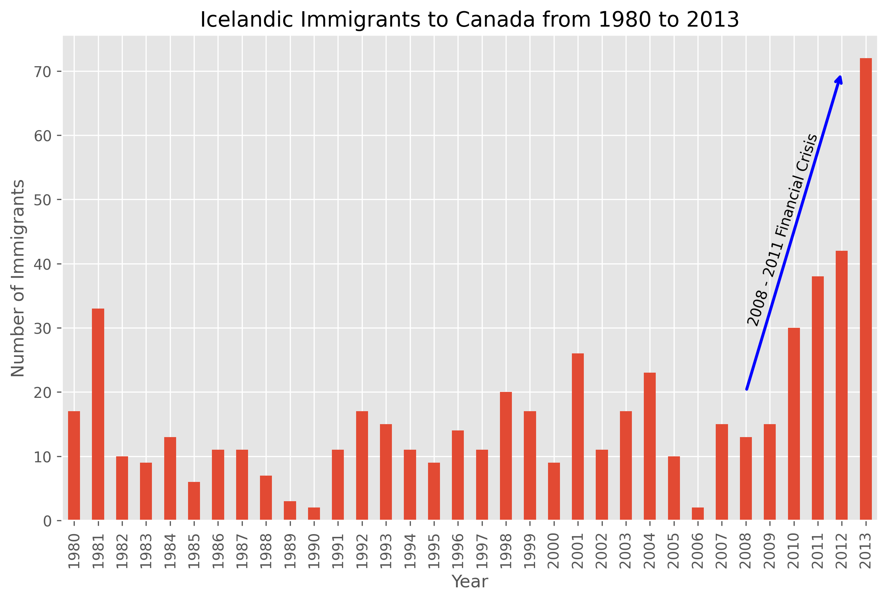
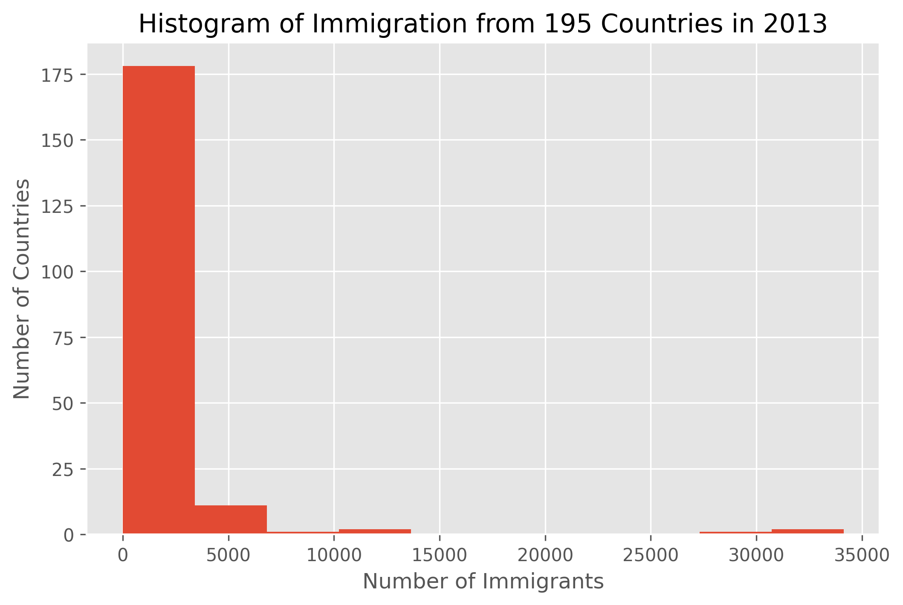
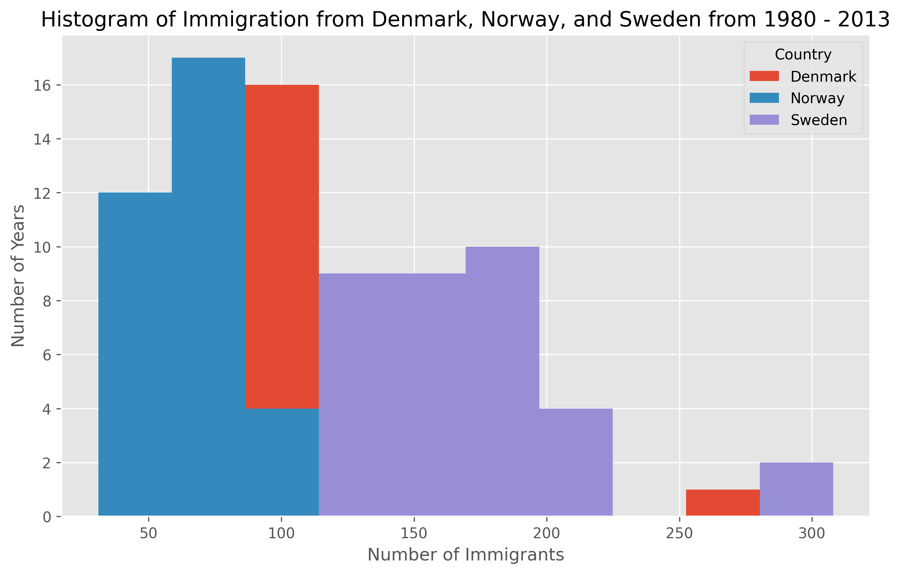
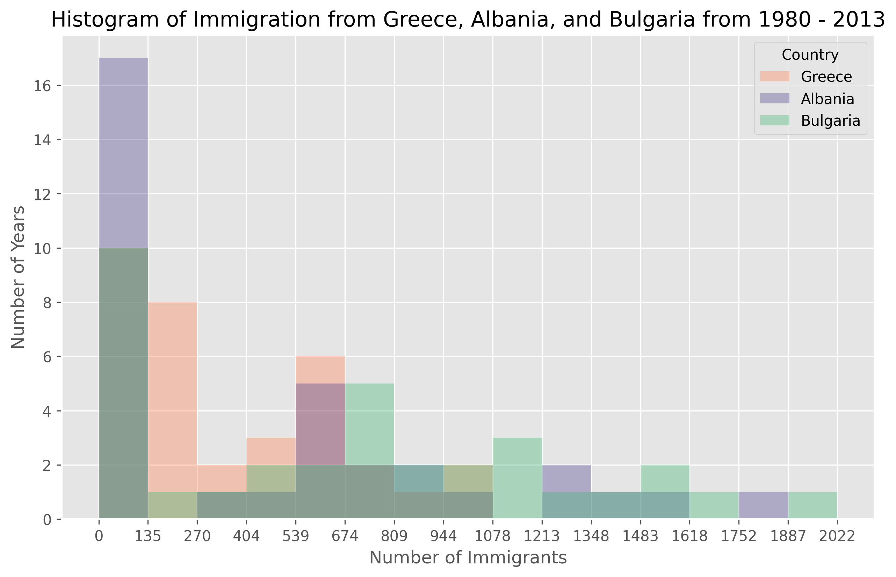

# immigration-data-visualization
Plots regards immigration data
# 🇨🇦 Canada Immigration Data Visualization (1980–2013)

## 📌 Project Overview

This project explores immigration trends to Canada from 1980 to 2013 using Python and data visualization libraries. The objective is to analyze immigration patterns, identify top contributing countries, and understand distribution trends through visual storytelling.

This project demonstrates practical skills in:

- Data Cleaning and Preparation
- Exploratory Data Analysis (EDA)
- Data Visualization using Matplotlib
- Working with real-world datasets using Pandas and NumPy

---

## 🛠️ Tools and Technologies

- Python
- Pandas
- NumPy
- Matplotlib
- Jupyter Notebook

---

## 📊 Visualizations and Insights

---

## Top 15 Countries Contributing to Immigration (1980–2013)

This horizontal bar chart shows the total number of immigrants from the top 15 countries. India and China contributed the highest number of immigrants, followed by the United Kingdom and the Philippines.

---

## Immigration Trend of Top 5 Countries

This area plot shows immigration trends over time for the top five contributing countries. It highlights steady growth in immigration over the years.

---

## Immigration Trend of Least Contributing Countries

This plot visualizes countries with the lowest immigration contributions, helping identify countries with minimal migration patterns.

---

## Iceland Immigration Trend with Financial Crisis Annotation

This bar chart shows immigration trends from Iceland and highlights the impact of the 2008–2011 global financial crisis using annotations.

---

## Immigration Distribution Histogram (All Countries – 2013)

This histogram shows the distribution of immigration counts across 195 countries in 2013. Most countries contributed smaller numbers, while a few contributed significantly more.

---

## Histogram: Denmark, Norway, Sweden

This visualization compares immigration distributions among Scandinavian countries.

---

## Histogram: Greece, Albania, Bulgaria

This histogram compares immigration patterns across selected European countries.

---

